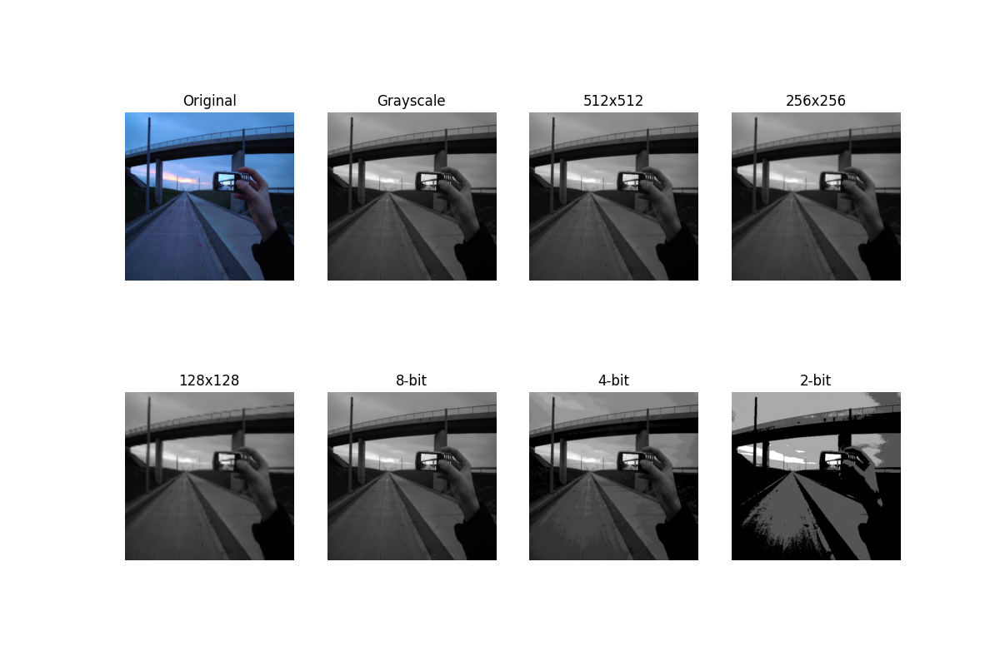
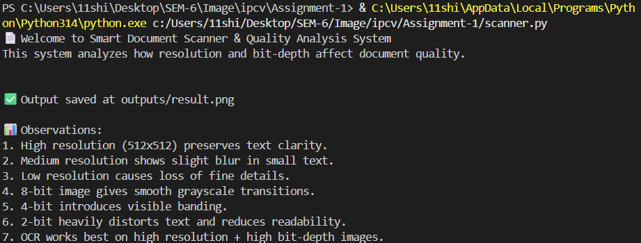

# Smart Document Scanner & Quality Analysis System

**Course:** Image Processing & Computer Vision

**Assignment:** Mini Project — Assignment 1
**Student:** Shikhar Bajpai &nbsp;|&nbsp; 
Roll No: 2301010188
**University:** KR Mangalam University

---

## Problem Statement

In real-world environments such as universities, banks, and offices, documents are often digitized using scanners or mobile cameras. However, poor image acquisition, low resolution, and reduced bit-depth can significantly affect readability and OCR (Optical Character Recognition) accuracy.

This project simulates a **Smart Document Scanner System** to analyze how **Image Sampling (Resolution)** and **Image Quantization (Bit Depth)** affect document quality.

---

## Objectives

- Understand image acquisition and preprocessing
- Convert images to grayscale
- Analyze resolution through sampling effects
- Analyze bit-depth reduction via quantization
- Compare visual quality and readability
- Evaluate suitability for OCR systems

---

## Technologies Used

- Python
- OpenCV
- NumPy
- Matplotlib

---

## Project Structure

```
Assignment-1/
├── scanner.py
├── README.md
├── inputs/
│   └── doc1.png
└── outputs/
    ├── result.png
    └── terminalResult.png
```

---

## Features Implemented

### Image Acquisition
- Input image loaded from `inputs/` folder
- Resized to 512×512
- Converted to grayscale

### Image Sampling (Resolution Analysis)

| Level | Resolution | Effect |
|-------|------------|--------|
| High | 512×512 | Full detail preserved |
| Medium | 256×256 | Slight blur in small text |
| Low | 128×128 | Loss of fine details |

All downsampled images are upscaled back to 512×512 for side-by-side comparison.

### Image Quantization (Bit Depth Reduction)

| Bit Depth | Gray Levels | Effect |
|-----------|-------------|--------|
| 8-bit | 256 levels | Original quality |
| 4-bit | 16 levels | Slight banding/distortion |
| 2-bit | 4 levels | Heavy blocking, major info loss |

### Visualization
- All outputs displayed in a single comparison figure
- Results saved automatically in `outputs/` folder

---

## How to Run

### Step 1 — Install dependencies
```bash
pip install opencv-python numpy matplotlib
```

### Step 2 — Run the script
```bash
python scanner.py
```

### Step 3 — Provide input when prompted
```
Enter image name: doc1.png
```

---

## Output Results

### Input Image


### Comparison Figure


### Terminal Output


---

## Observations & Analysis

### Resolution (Sampling Effects)
- High resolution preserves text clarity and sharp edges
- Medium resolution introduces slight blur in smaller text
- Low resolution results in loss of fine details and readability

### Quantization Effects
- 8-bit images maintain smooth grayscale transitions
- 4-bit images show visible banding and reduced contrast
- 2-bit images appear blocky with major information loss

### OCR Suitability
- OCR performs best on high-resolution, 8-bit images
- Poor resolution and low bit-depth significantly reduce OCR accuracy
- Minimum recommended: 256×256 resolution with 4-bit depth for basic readability

---

## Sample Test Inputs

This project can be tested using:
- Printed document images
- Scanned PDF pages
- Mobile-captured documents

---

## References

- [OpenCV Official Documentation](https://docs.opencv.org)
- [Matplotlib Documentation](https://matplotlib.org/stable/contents.html)
- Gonzalez & Woods — *Digital Image Processing* (Sampling & Quantization concepts)

---

## Academic Integrity

This project is an original individual submission by Shikhar Bajpai (2301010188).
All external references are cited above. No plagiarism has been done.

---

## Conclusion

This project successfully demonstrates how image quality is affected by resolution and bit-depth. It highlights the importance of proper image acquisition for document scanning and OCR-based systems.
