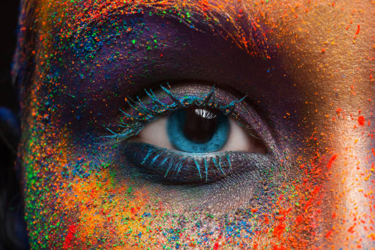
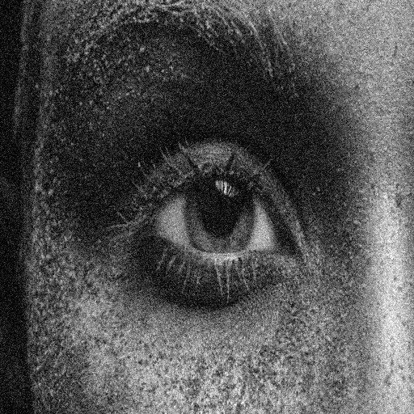
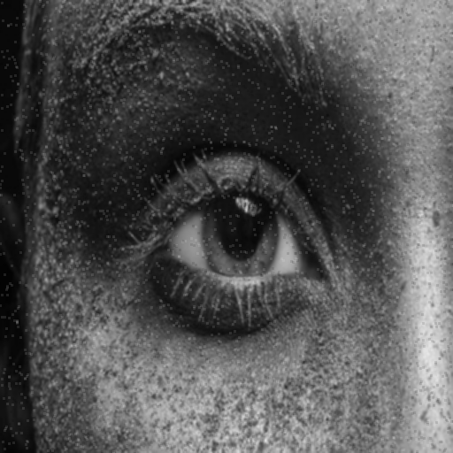
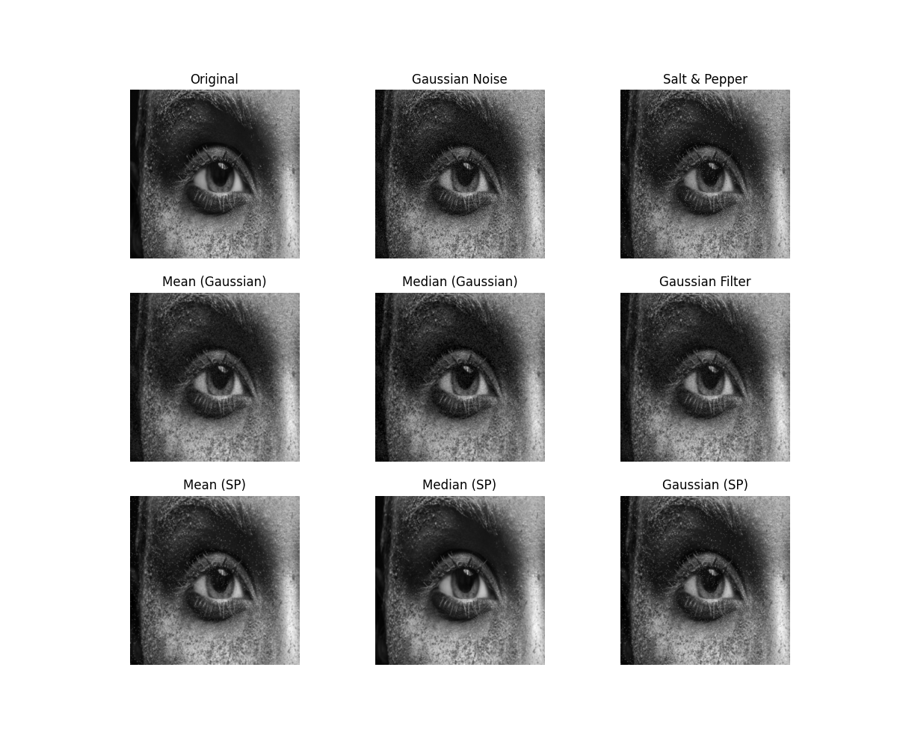
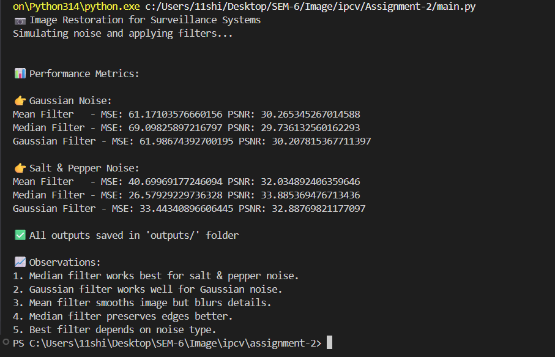

# Image Restoration for Surveillance Camera Systems


* **Course:** Image Processing & Computer Vision  
* **Assignment:** Mini Project Assignment (Assignment-2)  
* **Student Name:** Shikhar Bajpai  
* **Roll No:** 2301010188  
* **University:** KR Mangalam University  

---

## Problem Statement

Surveillance cameras often operate in challenging environments such as low light, rain, fog, and dust. These conditions introduce noise into captured images, making it difficult to identify objects clearly.

This project simulates real-world noise conditions and restores image quality using image processing techniques.

---

## Objectives

- Understand common image noise types
- Simulate real-world noise (Gaussian, Salt & Pepper)
- Apply image restoration filters (Mean, Median, Gaussian)
- Evaluate restoration performance using MSE and PSNR

---

## Technologies Used

- Python
- OpenCV
- NumPy
- Matplotlib

---

## Project Structure

```
Assignment-2/
├── main.py
├── README.md
├── inputs/
│   └── doc1.jpg
└── outputs/
    ├── original.png
    ├── gaussian_noise.png
    ├── sp_noise.png
    ├── mean_gaussian.png
    ├── median_gaussian.png
    ├── gaussian_filtered.png
    ├── mean_sp.png
    ├── median_sp.png
    ├── gaussian_sp.png
    ├── restoration_result.png
    └── terminalResult.png
```

---

## Features Implemented

### Image Preprocessing
- Input image loaded from `inputs/` folder
- Resized to 512×512
- Converted to grayscale

### Noise Modeling

| Noise Type | Real-World Equivalent |
|------------|----------------------|
| Gaussian Noise | Sensor/electronic noise in low-light conditions |
| Salt & Pepper Noise | Impulse noise from data transmission errors |

### Image Restoration Filters

| Filter | Best For |
|--------|----------|
| Mean Filter | General smoothing |
| Median Filter | Salt & Pepper noise removal |
| Gaussian Filter | Gaussian noise reduction |

### Performance Evaluation
- **MSE (Mean Squared Error)** — lower is better
- **PSNR (Peak Signal-to-Noise Ratio)** — higher is better

---

## How to Run

### Step 1 — Install dependencies
```bash
pip install opencv-python numpy matplotlib
```

### Step 2 — Run the script
```bash
python main.py
```

---

## Output Results

### Original Image


### Noisy Images

**Gaussian Noise**


**Salt & Pepper Noise**


### Restored Images

#### Gaussian Noise Restoration


#### Salt & Pepper Noise Restoration



### Final Comparison



---

## Observations & Analysis

### Gaussian Noise
- Mean filter and Gaussian filter perform better — they smooth out continuous noise effectively
- Median filter is less effective as it is designed for impulse-type noise, not continuous noise

### Salt & Pepper Noise
- Median filter gives the best results — it replaces each pixel with the median of neighbors, removing isolated spikes while preserving edges
- Mean and Gaussian filters only blur the noise rather than eliminating it

### Performance Summary

| Metric | Meaning | Ideal Value |
|--------|---------|-------------|
| MSE | Average pixel-level error between original and restored | As low as possible |
| PSNR | Signal quality ratio in decibels | Above 30 dB is acceptable |

---

## Sample Test Inputs

This project can be tested using:
- Street view / traffic camera images
- Parking lot surveillance images
- Indoor corridor images

---

## References

- [OpenCV Official Documentation](https://docs.opencv.org)
- [Matplotlib Documentation](https://matplotlib.org/stable/contents.html)
- Gonzalez & Woods — *Digital Image Processing*, 4th Ed. (Noise models and restoration filters)

---

## Academic Integrity

This project is an original individual submission by Shikhar Bajpai (2301010188).
All external references are cited above. No plagiarism has been done.

---

## Conclusion

This project demonstrates how different noise types affect surveillance images and how selecting the appropriate filter is critical for effective restoration. Median filtering is best for Salt & Pepper noise, while Gaussian and Mean filters are better suited for continuous Gaussian noise. MSE and PSNR provide quantitative measures to validate restoration quality.
