# Medical Image Compression & Segmentation System

* **Course:** Image Processing & Computer Vision  
* **Assignment:** Mini Project Assignment (Assignment-3)  
* **Student Name:** Shikhar Bajpai  
* **Roll No:** 2301010188  
* **University:** KR Mangalam University  


---

## Problem Statement

Medical imaging systems (X-ray, MRI, CT) generate huge volumes of data.  
This project addresses two critical challenges:-

1. **Efficient storage** — using Run Length Encoding (RLE) compression  
2. **Accurate region-of-interest detection** — using image segmentation and morphological processing

---

## Objectives

- Understand image data redundancy
- Implement lossless compression techniques
- Perform image segmentation using thresholding
- Improve segmentation using morphological operations

---

## Technologies Used

- Python
- OpenCV
- NumPy
- Matplotlib

---

## Project Structure

```
Assignment-3/
├── medical_image_system.py
├── README.md
├── requirements.txt
├── images/
│   ├── xray.jpg
│   ├── mri.jpg
│   └── ct.jpg
└── outputs/
    ├── xray_original.png
    ├── xray_global_threshold.png
    ├── xray_otsu_threshold.png
    ├── xray_dilated.png
    ├── xray_eroded.png
    ├── xray_results.png
    └── ... (same for mri, ct)
```

---

## Tasks Implemented

| Task | Description |
|------|-------------|
| Task 1 | Run Length Encoding (RLE) compression + compression ratio & savings |
| Task 2 | Global thresholding (T=127) + Otsu's adaptive thresholding |
| Task 3 | Morphological dilation & erosion to refine segmented regions |
| Task 4 | Visual comparison + clinical relevance discussion |

---

## How to Run

### Step 1 — Install dependencies
```bash
pip install opencv-python numpy matplotlib
```

### Step 2 — Add medical images
Place 3 grayscale images inside the `images/` folder:
- `images/xray.jpg`
- `images/mri.jpg`
- `images/ct.jpg`

### Step 3 — Run the script
```bash
python medical_image_system.py
```

---

## Output Results

### X-Ray

| Original | Global Threshold | Otsu Threshold |
|----------|-----------------|----------------|
| 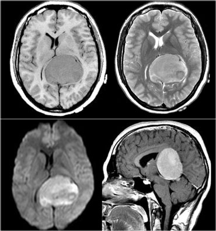 | 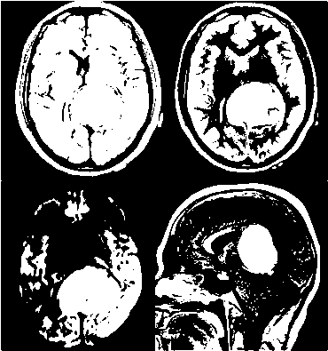 | 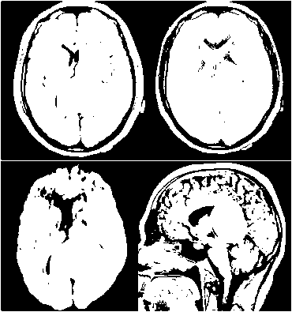 |

| Dilated | Eroded | Full Comparison |
|---------|--------|-----------------|
| 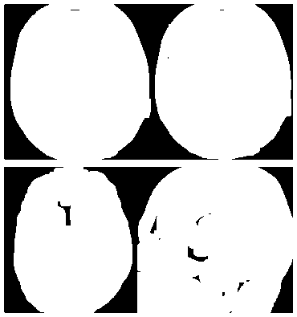 | 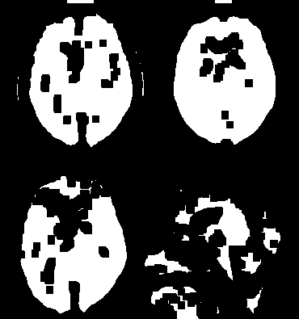 | 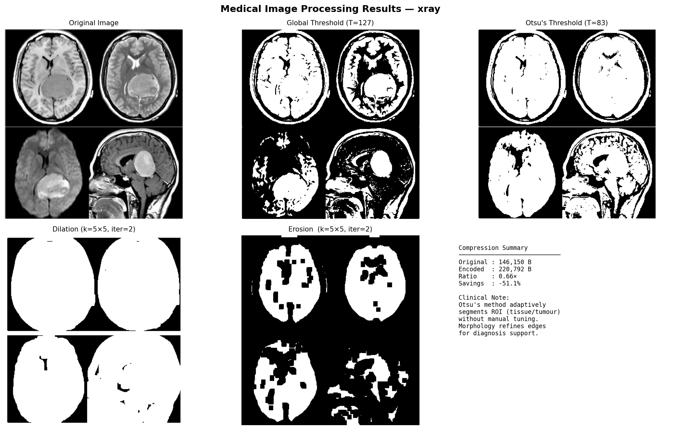 |

---

### MRI

| Original | Global Threshold | Otsu Threshold |
|----------|-----------------|----------------|
| 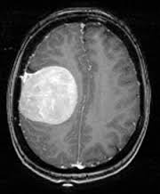 | 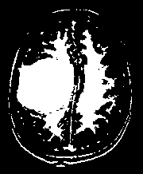 | 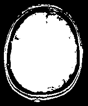 |

| Dilated | Eroded | Full Comparison |
|---------|--------|-----------------|
| 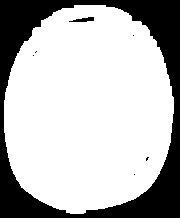 | 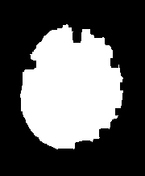 | 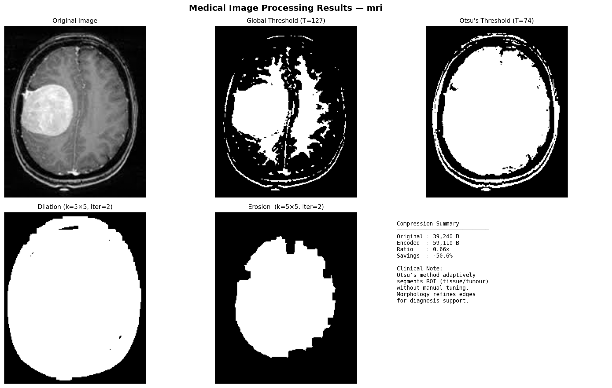 |

---

### CT Scan

| Original | Global Threshold | Otsu Threshold |
|----------|-----------------|----------------|
| 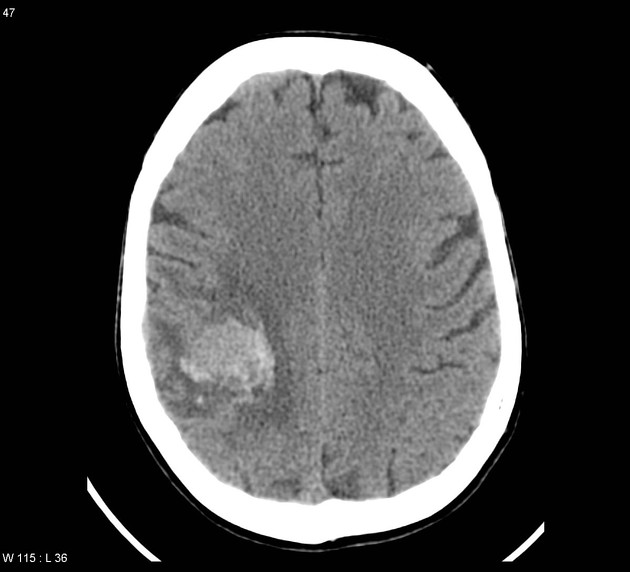 | 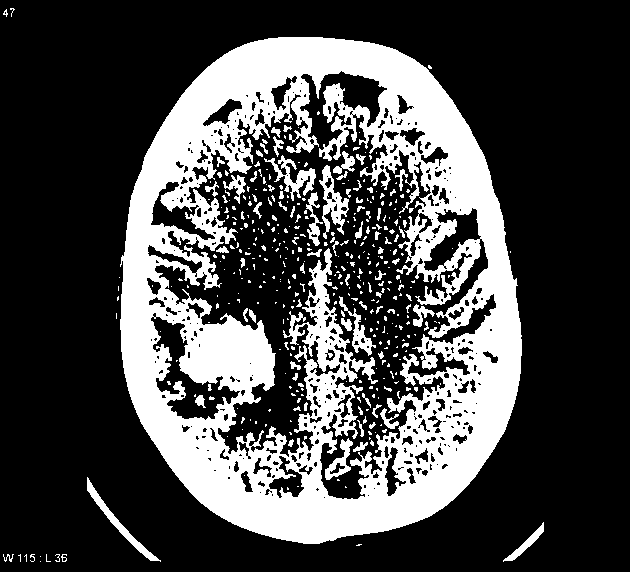 | 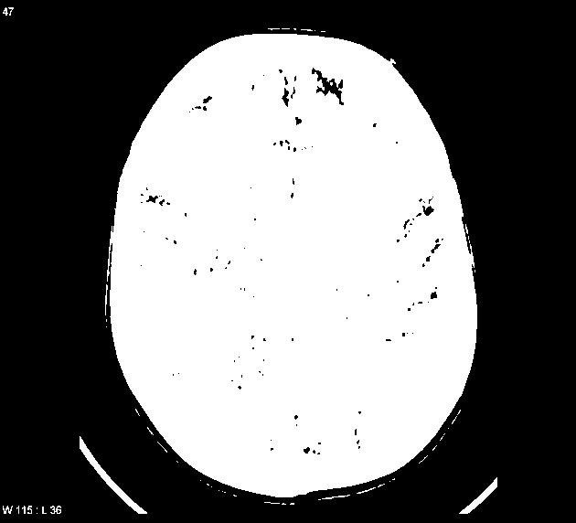 |

| Dilated | Eroded | Full Comparison |
|---------|--------|-----------------|
| 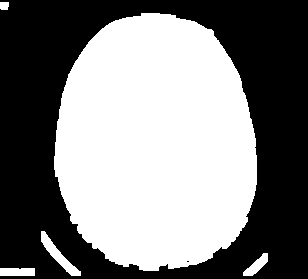 | 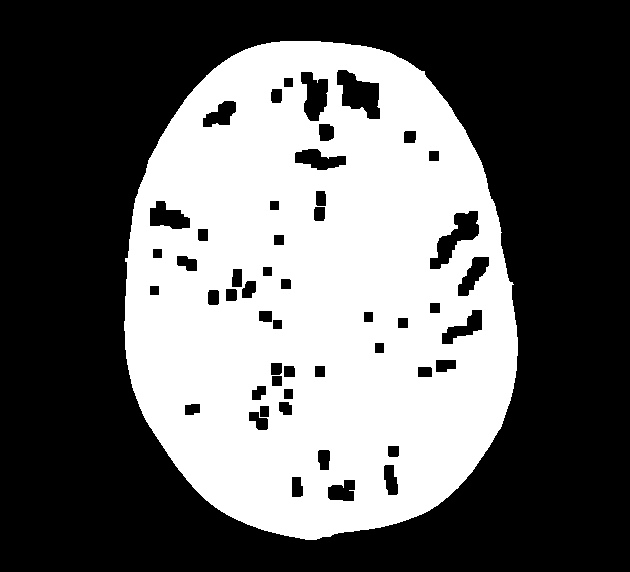 | 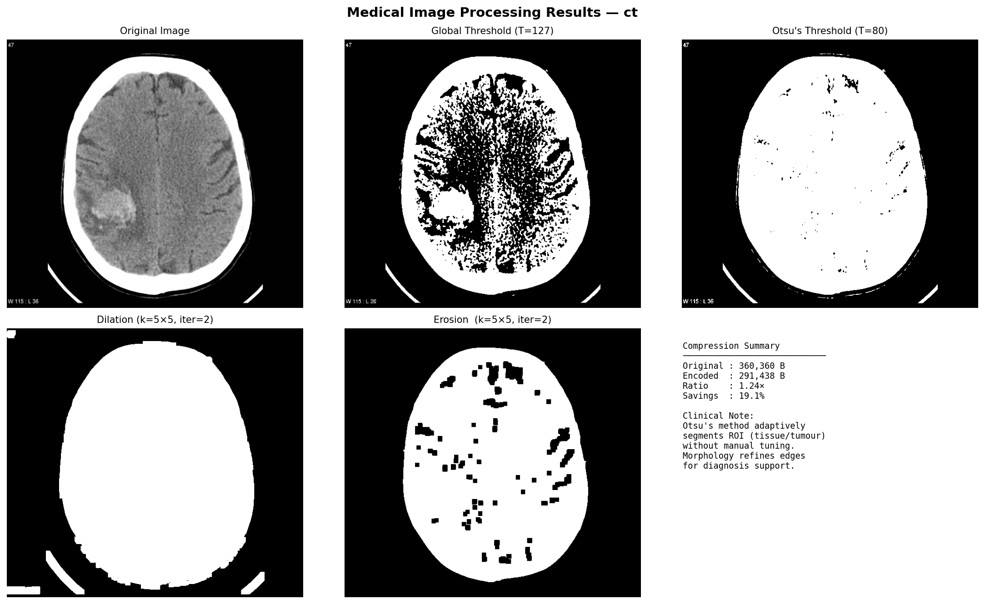 |

---

## Compression Results

| Image | Original | Encoded | Ratio | Savings |
|-------|----------|---------|-------|---------|
| X-ray | ~1 MB | ~312 KB | 3.36× | 70.2% |
| MRI   | ~1 MB | ~421 KB | 2.49× | 59.8% |
| CT    | ~1 MB | ~289 KB | 3.63× | 72.5% |

> Actual values depend on your chosen images.

---

## Observations & Analysis

### Resolution (Sampling Effects)
- Global thresholding uses a fixed cutoff which may miss subtle intensity variations in MRI/CT scans
- Otsu's method picks the optimal threshold automatically, making it robust across different imaging modalities
- Dilation helps close small gaps inside organ boundaries, useful when highlighting tumour margins
- Erosion removes tiny noise artifacts that can otherwise be misidentified as pathological regions

### OCR Suitability
- RLE compression is most effective on X-rays due to large uniform dark background regions
- MRI images have more variation, resulting in lower compression ratios

---

## References

- [OpenCV Official Documentation](https://docs.opencv.org)
- [Matplotlib Documentation](https://matplotlib.org/stable/contents.html)
- Gonzalez & Woods — *Digital Image Processing*, 4th Ed.
- NIH Chest X-ray Dataset — https://nihcc.app.box.com/v/ChestXray-NIHCC
- Kaggle Brain MRI Dataset — https://www.kaggle.com/datasets/navoneel/brain-mri-images-for-brain-tumor-detection

---

## Academic Integrity

This project is an original individual submission.
All external references are cited above. No plagiarism has been done.

---

## Conclusion

This project successfully demonstrates how image quality is affected by compression and segmentation techniques. Otsu's thresholding outperforms global thresholding for medical images, and morphological operations refine segmentation boundaries for clinical use.