# Feature-Based Traffic Monitoring System

* **Course:** Image Processing & Computer Vision  
* **Assignment:** Mini Project Assignment (Assignment-4)  
* **Student Name:** Shikhar Bajpai  
* **Roll No:** 2301010188  
* **University:** KR Mangalam University  


---

## Problem Statement

Traffic monitoring systems rely on detecting vehicles, lanes, and pedestrians. Feature extraction and object representation are fundamental steps in modern intelligent transportation systems.

This project simulates a **feature-based traffic analysis system** that detects edges, represents objects using contours, and extracts keypoint features from traffic images.

---

## Objectives

- Detect edges and object boundaries using Sobel and Canny operators
- Represent objects using contours and bounding boxes
- Extract keypoint features using ORB
- Compare edge detectors and feature extractors and discuss their role in traffic monitoring

---

## Technologies Used

- Python
- OpenCV
- NumPy
- Matplotlib

---

## Project Structure

```
Assignment-4/
├── traffic_monitoring.py
├── README.md
├── requirements.txt
├── images/
│   ├── traffic1.jpg
│   ├── traffic2.jpg
│   └── traffic3.jpg
└── outputs/
    ├── traffic1_original.png
    ├── traffic1_sobel.png
    ├── traffic1_canny.png
    ├── traffic1_contours.png
    ├── traffic1_bboxes.png
    ├── traffic1_orb_keypoints.png
    ├── traffic1_results.png
    └── ... (same for traffic2, traffic3)
```

---

## Tasks Implemented

| Task | Description |
|------|-------------|
| Task 1 | Sobel edge detection + Canny edge detection + comparison |
| Task 2 | Contour detection, bounding boxes, object area & perimeter |
| Task 3 | ORB keypoint extraction and descriptor visualization |
| Task 4 | Comparative analysis + traffic monitoring relevance discussion |

---

## How to Run

### Step 1 — Install dependencies
```bash
pip install opencv-python numpy matplotlib
```

### Step 2 — Add traffic images
Place 3 traffic images inside the `images/` folder:
- `images/traffic1.jpg` — road intersection
- `images/traffic2.jpg` — highway
- `images/traffic3.jpg` — pedestrian crossing

### Step 3 — Run the script
```bash
python traffic_monitoring.py
```

---

## Output Results

### Traffic Image 1 — Road Intersection

| Original | Sobel Edges | Canny Edges |
|----------|-------------|-------------|
| 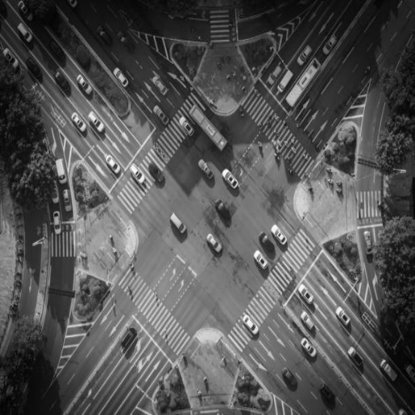 | 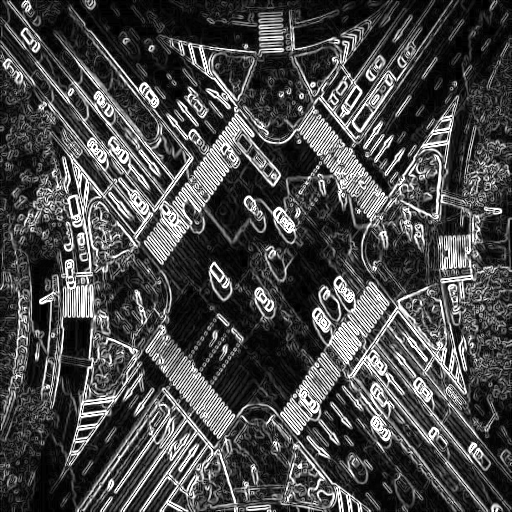 | 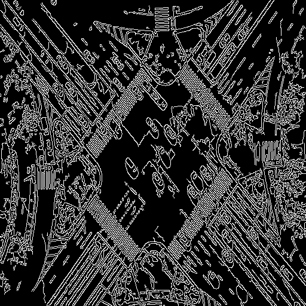 |

| Contours | Bounding Boxes | ORB Keypoints |
|----------|----------------|---------------|
| 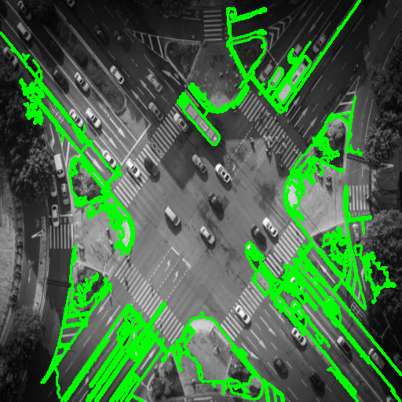 | 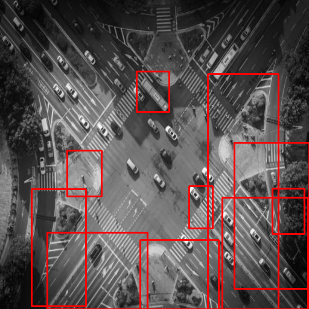 | 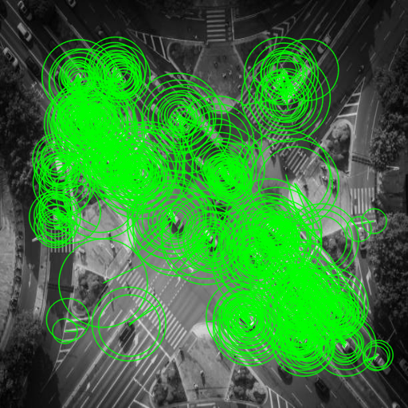 |

**Full Comparison**
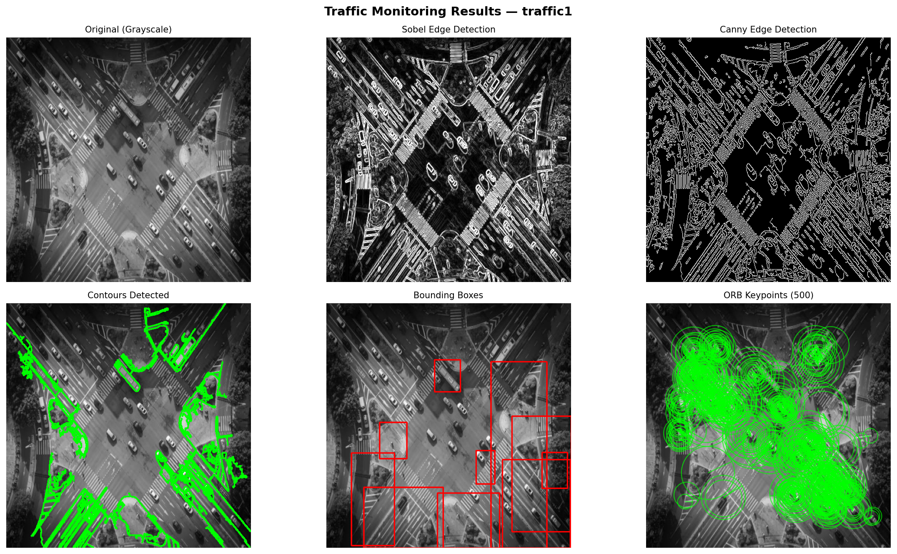

---

### Traffic Image 2 — Highway

| Original | Sobel Edges | Canny Edges |
|----------|-------------|-------------|
| 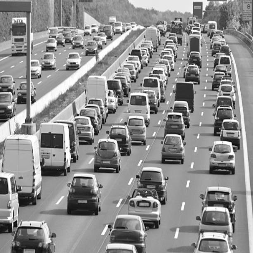 | 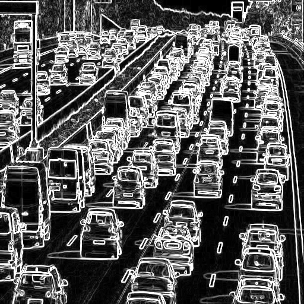 | 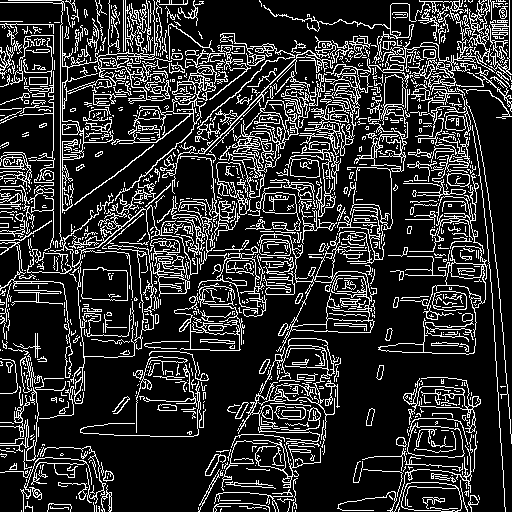 |

| Contours | Bounding Boxes | ORB Keypoints |
|----------|----------------|---------------|
| 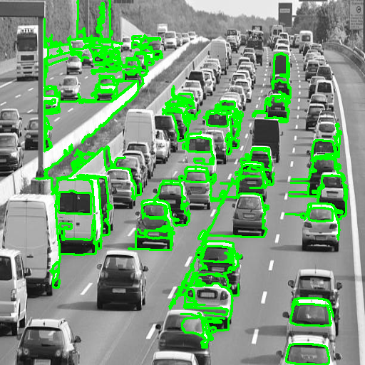 | 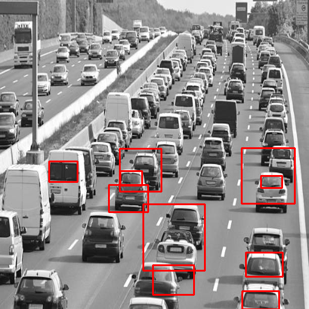 | 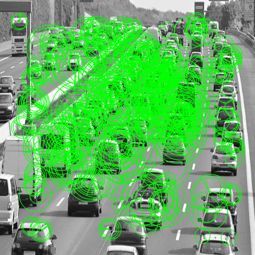 |

**Full Comparison**
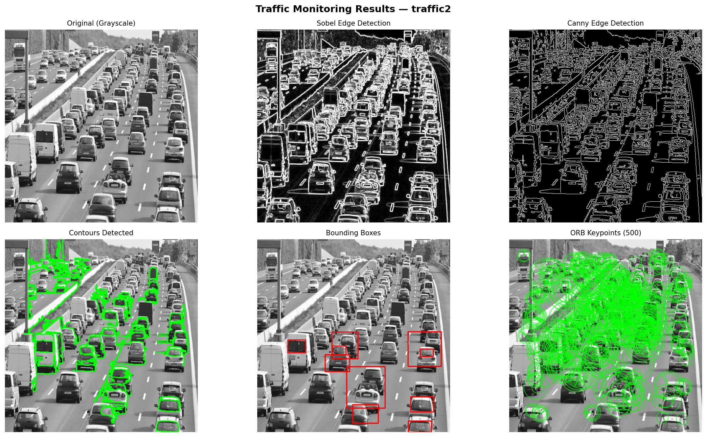

---

### Traffic Image 3 — Pedestrian Crossing

| Original | Sobel Edges | Canny Edges |
|----------|-------------|-------------|
|  | 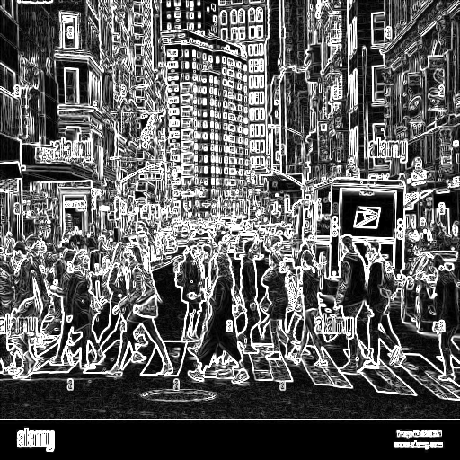 | 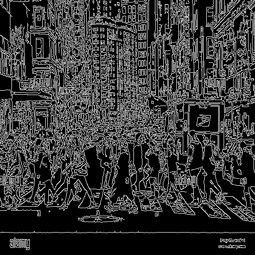 |

| Contours | Bounding Boxes | ORB Keypoints |
|----------|----------------|---------------|
| 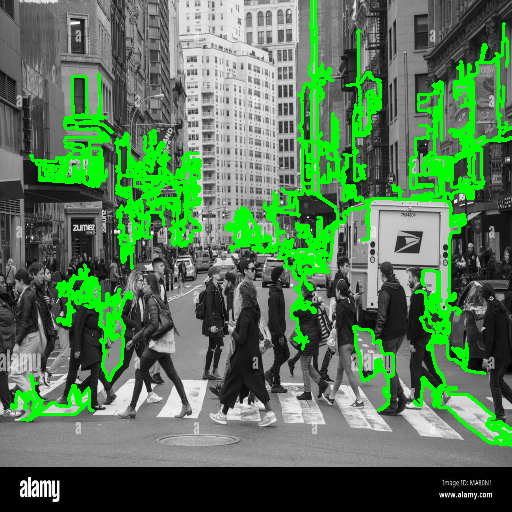 | 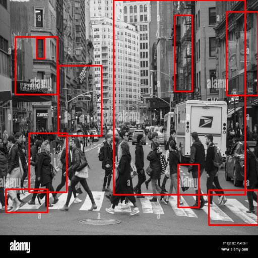 | 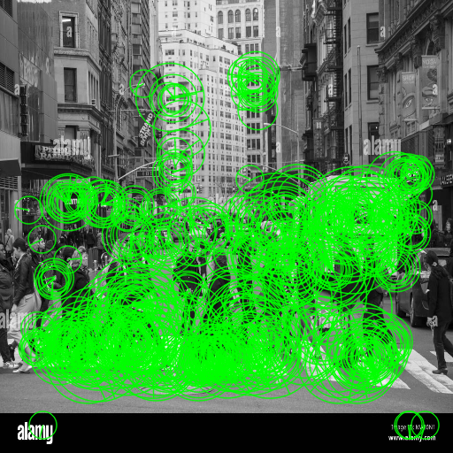 |

**Full Comparison**
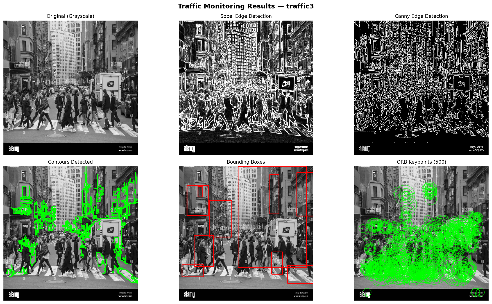

---

## Observations & Analysis

### Edge Detection Comparison

| Method | Strengths | Weaknesses |
|--------|-----------|------------|
| Sobel | Fast, simple gradient detection | Sensitive to noise, thick edges |
| Canny | Clean thin edges, double thresholding | Slightly slower, needs tuning |

Canny is preferred for traffic scenes as it produces more precise object boundaries.

### Object Representation
- Contours accurately outline vehicle shapes when Canny edges are used as input
- Bounding boxes provide quick spatial localization of detected objects
- Area and perimeter measurements help classify object size (car vs. truck vs. pedestrian)

### Feature Extraction — ORB
- ORB detects stable keypoints regardless of rotation or scale change
- Descriptors enable matching the same vehicle across multiple frames — essential for tracking
- ORB is patent-free and computationally efficient for real-time surveillance

---

## References

- [OpenCV Official Documentation](https://docs.opencv.org)
- [Matplotlib Documentation](https://matplotlib.org/stable/contents.html)
- Gonzalez & Woods — *Digital Image Processing*, 4th Ed.
- Rublee et al. (2011) — *ORB: An efficient alternative to SIFT or SURF*, ICCV

---

## Academic Integrity

This project is an original individual submission by Shikhar Bajpai (2301010188).
All external references are cited above. No plagiarism has been done.

---

## Conclusion

This project demonstrates how classical computer vision techniques — edge detection, contour analysis, and feature extraction — work together to form the foundation of a traffic monitoring system. Canny edge detection outperforms Sobel for boundary accuracy, and ORB provides robust, real-time-capable feature matching suitable for vehicle tracking in intelligent transportation systems.