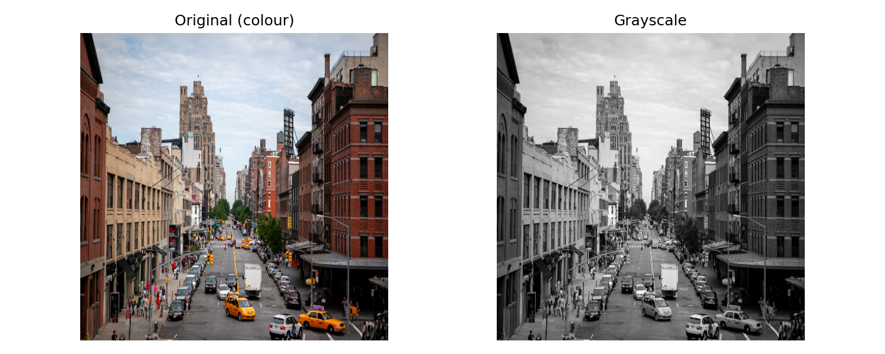
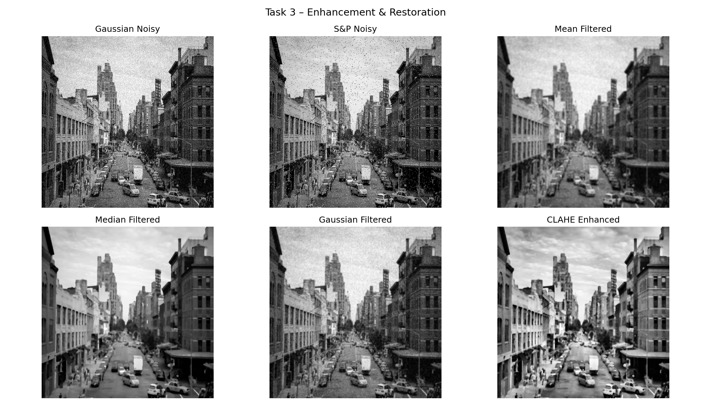
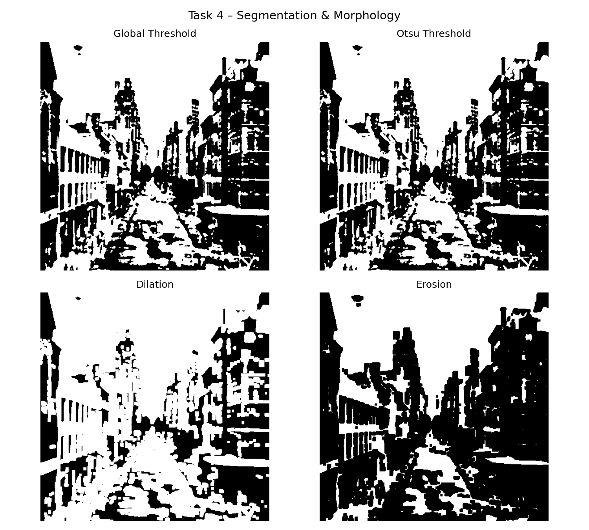
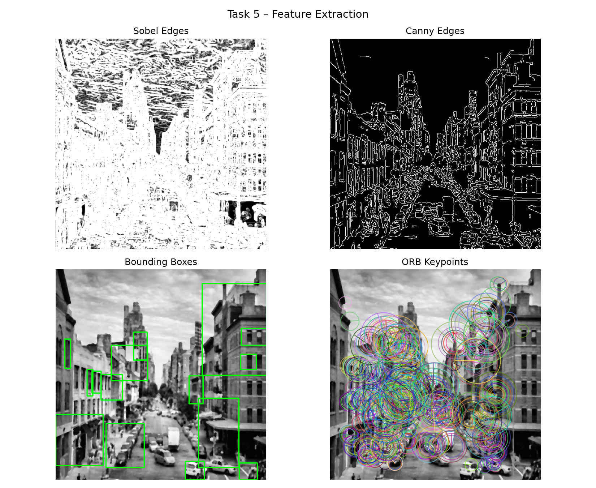
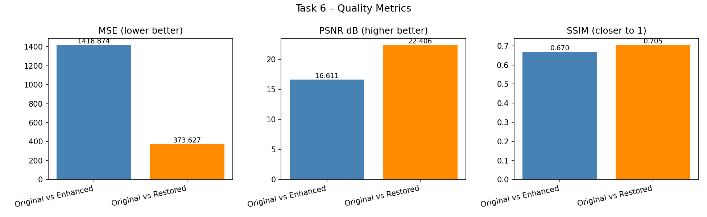
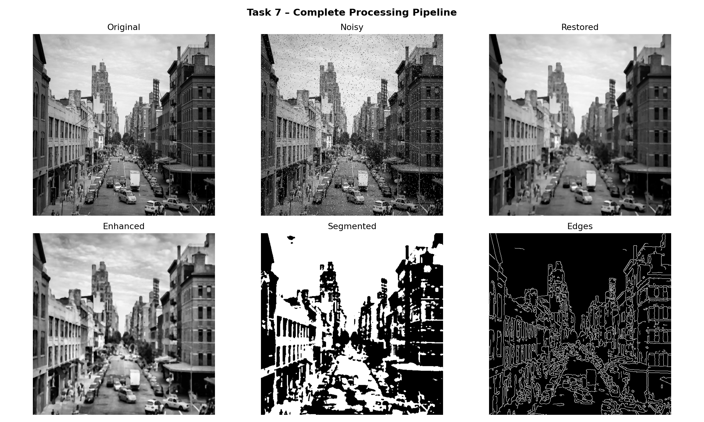

# Intelligent Image Enhancement & Analysis System

* **Course:** Image Processing & Computer Vision  
* **Assignment:** Mini Project Assignment (Assignment-2)  
* **Student Name:** Shikhar Bajpai  
* **Roll No:** 2301010188  
* **University:** KR Mangalam University  

---

## Problem Statement

In real-world applications such as surveillance systems, medical imaging, document digitization, and traffic monitoring, images captured by cameras often suffer from poor lighting, noise, low contrast, and unclear object boundaries.

This project simulates an **end-to-end intelligent image processing pipeline** that enhances image quality, restores degraded images, segments important regions, extracts meaningful features, and evaluates performance objectively.

---

## Objectives

- Acquire and preprocess images to a standard resolution
- Simulate real-world degradation (Gaussian & Salt-and-Pepper noise) and restore images
- Segment images using global and Otsu thresholding with morphological refinement
- Extract object boundaries and keypoint features using Sobel, Canny, and ORB
- Evaluate system performance using MSE, PSNR, and SSIM metrics

---

## Technologies Used

- Python
- OpenCV
- NumPy
- Matplotlib
- scikit-image

---

## Project Structure

```
Assignment-5/
├── main.py
├── README.md
├── requirements.txt
├── images/
│   ├── input1.jpg
│   ├── input2.jpg
│   └── input3.jpg
└── outputs/
    ├── 01_acquisition.png
    ├── 02_enhancement.png
    ├── 03_segmentation.png
    ├── 04_features.png
    ├── 05_metrics.png
    └── 06_pipeline.png
```

---

## Tasks Implemented

| Task | Description |
|------|-------------|
| Task 1 | Project setup, header comments, welcome banner |
| Task 2 | Image acquisition, resize to 512×512, grayscale conversion |
| Task 3 | Gaussian & S&P noise simulation + Mean / Median / Gaussian filtering + CLAHE |
| Task 4 | Global & Otsu thresholding + Dilation & Erosion |
| Task 5 | Sobel & Canny edge detection + Contours + Bounding boxes + ORB keypoints |
| Task 6 | MSE, PSNR, SSIM evaluation — Original vs Enhanced & Restored |
| Task 7 | Full pipeline visualization + conclusion |

---

## How to Run

### Step 1 — Install dependencies
```bash
pip install opencv-python numpy matplotlib scikit-image
```

### Step 2 — Add input images
Place 3 images inside the `images/` folder:
- `images/input1.jpg` — face / portrait
- `images/input2.jpg` — street / traffic scene
- `images/input3.jpg` — document scan / text image

### Step 3 — Run the script
```bash
python main.py images/input1.jpg
python main.py images/input2.jpg
python main.py images/input3.jpg
```

---

## Output Results

### Run 1 — Image 1

| Original & Grayscale |
|----------------------|
|  |

| Enhancement & Restoration |
|---------------------------|
|  |

| Segmentation & Morphology |
|---------------------------|
|  |

| Feature Extraction |
|--------------------|
|  |

| Performance Metrics |
|---------------------|
|  |

| Full Pipeline |
|---------------|
|  |

---

## Observations & Analysis

### Noise & Filtering

| Filter | Best For | Weakness |
|--------|----------|----------|
| Mean filter | Gaussian noise | Blurs edges |
| Median filter | Salt-and-Pepper noise | Slower on large kernels |
| Gaussian filter | Smooth Gaussian noise | Still slightly blurs |

Median filtering is preferred for S&P noise as it preserves edges while removing impulse noise.  
CLAHE improves local contrast without over-brightening the image globally.

### Segmentation

- Otsu thresholding automatically determines the optimal threshold — better than manual global thresholding for varied lighting conditions
- Dilation fills gaps in object boundaries; Erosion removes small noise blobs
- Together they produce clean, well-defined object regions

### Feature Extraction

| Method | Strengths | Weaknesses |
|--------|-----------|------------|
| Sobel | Fast gradient detection | Sensitive to noise, thick edges |
| Canny | Clean thin edges, double thresholding | Needs parameter tuning |
| ORB | Scale & rotation invariant, fast, patent-free | Less accurate than SIFT on extreme scale changes |

Canny edges feed cleaner contours into bounding box detection.  
ORB keypoints enable object matching across frames — useful for tracking.

### Performance Metrics

| Metric | Interpretation |
|--------|---------------|
| MSE | Lower is better — measures pixel-level error |
| PSNR | Higher is better (>30 dB is acceptable quality) |
| SSIM | Closer to 1.0 is better — measures structural similarity |

---

## References

- [OpenCV Official Documentation](https://docs.opencv.org)
- [scikit-image Documentation](https://scikit-image.org/docs/)
- [Matplotlib Documentation](https://matplotlib.org/stable/contents.html)
- Gonzalez & Woods — *Digital Image Processing*, 4th Ed.
- Rublee et al. (2011) — *ORB: An efficient alternative to SIFT or SURF*, ICCV

---

## Academic Integrity

This project is an original individual submission by Shikhar Bajpai (2301010188).  
All external references are cited above. No plagiarism has been done.

---

## Conclusion

This project demonstrates a complete end-to-end image processing pipeline. Median filtering outperforms mean and Gaussian filters for impulse noise. CLAHE enhances local contrast effectively without global over-exposure. Otsu thresholding produces cleaner segmentation than fixed global thresholding. Canny edge detection provides sharper, less noisy boundaries compared to Sobel. ORB keypoints offer robust, real-time-capable feature extraction suitable for object tracking. PSNR and SSIM together provide a reliable and objective measure of image quality improvement across the pipeline.